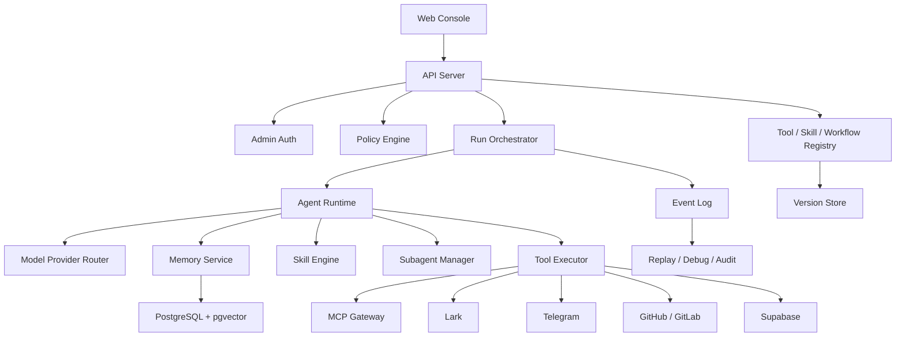

# CtalosAgent Spec v0.1

## 1. 背景与目标

构建一个单企业单租户的企业级中控 Agent，用于统筹项目管理、产品管理、数据分析、用户增长与市场营销、技术研发等业务。系统以 Web 控制台为主入口，支持强执行能力、长期记忆、自我学习、Skill/SOP 自动迭代、结构化事件日志、任务重放、调试、审计和补偿式回滚。

该系统从零新建企业版骨架，参考 Hermes Agent 的 memory、skills、subagent、tool registry 设计，同时吸收 claw-code 在权限边界、权限模式、skills、插件系统、Anthropic/Claude 风格交互方面的设计思想。

## 2. 核心原则

1. Agent 可以执行任务，但平台源码、后端逻辑、数据库 schema、前端控制台代码不可被 Agent 自我修改。
2. 自我进化只允许发生在 Skill、SOP、工作流模板、提示词、工具使用经验、避坑库和任务产物文件层。
3. 测试环境和低风险任务允许自动执行。
4. 生产环境和高风险任务必须触发人工审批。
5. 所有外部动作必须生成结构化事件日志，支持重放、审计、调试和补偿式回滚。
6. 所有工具调用必须经过权限策略、风险分级、执行日志和回滚计划。
7. 长期记忆和 Skill 迭代默认自动生效，但必须版本化、可回滚、可追踪来源。

## 3. MVP 范围

### 3.1 业务域

第一版覆盖：

- 项目管理
- 产品管理
- 数据分析
- 用户增长与市场营销
- 技术研发

### 3.2 集成系统

第一版接入：

- Lark / 飞书：文档、任务、消息
- Telegram：消息收发
- GitHub / GitLab：代码、Issue、PR/MR、CI 状态
- Supabase：数据库查询与 SQL 执行
- MCP：接入外部工具与服务

### 3.3 标杆工作流

1. 回忆上周测试用例中的 bug，读取最新模块 SOP，修改 bug，并生成 HTML 演示文件。
2. 利用指定 Skills 生成竞品调研报告，并写入指定 Lark 文档。
3. 更新全部 Skills，返回每个 Skill 的更新状态、版本变化和失败原因。
4. 调用 subagents 从运营、产品、开发三个视角生成当前产品策略的反方观点，并汇总报告。
5. 将上述流程沉淀为通用 Skill，形成后续可复用 SOP。
6. 回滚上一个版本的 Skill / SOP / 工作流模板 / 任务产物。
7. 为每次任务生成结构化事件日志，支持完整重放、调试、审计，并自动提取到 SOP 和避坑库。
8. 每次任务结束后自动触发记忆更新、Skill 迭代、性能评估。
9. 通过 MCP 安全接入外部工具，保证互操作可控。

## 4. 推荐技术栈

### 4.1 总体选择

采用 TypeScript + Python 的双运行时架构：

- TypeScript / Node.js：Web 控制台、API Server、权限策略、任务编排入口、工具注册、审计查询。
- Python 3.12+：Agent Runtime、模型调用、记忆检索、Skill 执行、Subagent 编排。

理由：

- TypeScript 适合 Web 控制台、API schema、插件 manifest、前后端类型共享。
- Python 适合 LLM、RAG、Agent loop、数据分析、工具生态和快速迭代。
- 不使用 Rust 作为主栈，避免提高团队长期维护成本；仅在未来高安全 sandbox executor 中考虑 Rust。

### 4.2 组件选型

- 前端：React + TypeScript + Vite
- API Server：Node.js + Fastify 或 NestJS
- Agent Runtime：Python + FastAPI worker / async task worker
- 数据库：PostgreSQL
- 向量检索：pgvector
- 队列：Redis Queue / BullMQ，后续可升级 Temporal
- 工作流：MVP 可先实现内部 workflow engine，生产增强版引入 Temporal
- 对象存储：本地文件系统起步，后续兼容 S3
- 可观测性：OpenTelemetry + structured logs
- 模型供应商：OpenAI、Claude、Gemini、DeepSeek、智谱、Kimi，统一 Provider Adapter
- MCP：独立 MCP Gateway，所有外部 MCP server 通过策略层接入

## 5. 系统架构



## 6. 核心模块

### 6.1 Web Console

提供：

- 创建任务、查看任务执行过程
- 查看 Tool Call、模型调用、事件日志
- 查看和管理 Memory、Skill、SOP、Workflow Template
- 审批生产环境 / 高风险动作
- 查看回滚计划和执行补偿式回滚
- 查看性能评估、Skill 迭代记录和错误归因

MVP 仅需单管理员账户，但数据模型需预留 user、role、permission 字段。

### 6.2 Agent Runtime

负责：

- 解析用户目标
- 构造上下文
- 检索长期记忆和相关 Skill
- 规划任务
- 调用工具
- 调用 subagents
- 生成结构化事件
- 任务结束后触发记忆更新、Skill 迭代和评估

Agent loop 采用 Claude / Anthropic 风格：

- system prompt
- developer instruction
- user task
- tool use
- tool result
- assistant reasoning summary
- final answer

内部必须保留完整事件，不要求暴露完整 chain-of-thought。

### 6.3 Tool Registry

所有工具必须通过 manifest 注册：

```yaml
name: supabase.execute_sql
owner: data
risk_level: high
environment: test|production
requires_approval_on:
  - production
  - destructive_sql
input_schema: {}
output_schema: {}
rollback_strategy: transaction|reverse_sql|snapshot|manual_compensation
timeout_seconds: 60
```

工具类型：

- Lark tools
- Telegram tools
- GitHub / GitLab tools
- Supabase tools
- File artifact tools
- MCP tools
- Internal memory / skill tools

### 6.4 Policy Engine

权限模式参考 claw-code：

- `read_only`：只能读记忆、文档、代码、数据库。
- `workspace_write`：可写测试产物、创建任务、修改测试分支、执行测试库 SQL。
- `approval_required`：生产、高风险、不可天然回滚操作。
- `admin_full_access`：管理员显式授予的临时高权限。

策略判断输入：

- actor
- tool
- environment
- resource
- risk_level
- operation_type
- rollback_available
- estimated_blast_radius

### 6.5 Memory Service

记忆分层：

- Episodic Memory：任务过程、对话、事件日志、执行轨迹。
- Semantic Memory：项目背景、产品策略、竞品信息、业务事实。
- Procedural Memory：SOP、Skill、工具经验、避坑库。
- Performance Memory：任务耗时、失败原因、模型表现、工具成功率。

所有记忆必须带来源、版本、作用域、置信度、创建时间和最近使用时间。

### 6.6 Skill Engine

Skill 是可版本化的执行指南，不是平台源码。Skill 可以包含：

- 适用场景
- 输入输出 schema
- 执行步骤
- 推荐工具
- 风险提示
- 回滚方式
- 示例
- 评估指标

Skill 自动迭代流程：

1. 任务结束后抽取经验。
2. 对比现有 Skill。
3. 生成 Skill patch。
4. 自动运行格式校验和冲突检查。
5. 自动发布新版本。
6. 写入 changelog。
7. 保留可回滚版本。

### 6.7 Subagent Manager

支持基于角色生成多个 subagent：

- 产品视角
- 运营视角
- 开发视角
- 数据分析视角
- 安全审计视角

Subagent 只能在分配的上下文、工具权限和任务范围内工作。主 Agent 负责任务拆分、结果汇总和冲突消解。

### 6.8 Event Log / Replay

每次任务生成 append-only 事件流：

- task.created
- context.retrieved
- memory.used
- skill.used
- plan.created
- approval.requested
- tool.called
- tool.result
- artifact.created
- rollback.plan_created
- memory.updated
- skill.updated
- eval.completed
- task.completed
- task.failed

事件必须支持：

- 按 task replay
- 按 tool call debug
- 审计导出
- 失败定位
- 生成 SOP / 避坑库素材

### 6.9 Rollback

接受补偿式回滚：

- Git merge：revert commit / revert MR
- SQL：事务回滚、反向 SQL、备份点恢复或人工补偿任务
- Lark 文档：恢复历史版本或追加修正说明
- Telegram / Lark 消息：撤回能力可用则撤回，否则发送更正消息
- Skill / SOP：回滚到上一版本
- Artifact：恢复上一版本文件

高风险动作在执行前必须生成 rollback_plan。

## 7. 数据模型初稿

核心表：

- users
- tasks
- task_events
- tool_calls
- approvals
- rollback_plans
- memories
- memory_embeddings
- skills
- skill_versions
- workflows
- workflow_versions
- artifacts
- provider_configs
- mcp_servers
- eval_runs

## 8. 安全要求

1. API key、token、数据库连接串必须加密存储。
2. 工具执行必须做 timeout、rate limit、schema validation。
3. Supabase 写操作默认区分 test / production。
4. 生产环境 SQL、主分支合并、真实用户消息默认进入审批。
5. MCP server 默认不可信，必须显式注册能力和权限。
6. 所有自动学习结果必须版本化，支持回滚。
7. Agent 不能修改平台源码、后端逻辑、数据库 schema、前端控制台代码。

## 9. MVP 开发里程碑

### Phase 1: Foundation

- Monorepo 初始化
- Web Console 基础页面
- API Server
- PostgreSQL schema
- Task/Event Log
- Provider Adapter
- Tool Registry v1

### Phase 2: Agent Runtime

- Agent loop
- Memory retrieval
- Skill loading
- Tool call protocol
- Subagent manager
- Artifact generation

### Phase 3: Integrations

- Lark docs/tasks/messages
- Telegram messages
- GitHub/GitLab issues/PR
- Supabase read/write SQL
- MCP Gateway

### Phase 4: Safety & Replay

- Policy engine
- Approval flow
- Rollback plan
- Replay/debug UI
- Audit export

### Phase 5: Self Evolution

- Memory update after each task
- Skill auto-iteration
- SOP / 避坑库 extraction
- Performance eval
- Skill rollback

## 10. MVP 验收标准

1. 能通过 Web 控制台创建任务并实时查看执行过程。
2. 能完成至少 5 个标杆工作流。
3. 每个工具调用都有结构化日志、输入、输出、耗时、状态和风险等级。
4. 生产/高风险动作能触发审批。
5. Skill/SOP/Workflow Template 自动更新并可回滚。
6. 能基于历史记忆回忆上周 bug、读取 SOP 并生成修复产物。
7. 能调用 subagents 生成多视角分析并汇总。
8. 能把报告写入 Lark 文档。
9. 能执行 Supabase 测试环境 SQL，并为生产 SQL 生成审批。
10. 能通过事件日志重放一次完整任务。

## 11. 非目标

第一版不做：

- 多租户 SaaS
- 复杂 RBAC
- 自动修改平台源码
- 自动修改数据库 schema
- 多通信渠道泛化
- 完整移动端
- 大规模分布式 agent 集群

## 12. 关键风险

1. 自我进化过快导致 Skill 污染：通过版本化、回滚、评估分数控制。
2. 工具权限过宽：通过 manifest、policy、approval、环境隔离控制。
3. SQL 误操作：测试/生产隔离、事务、备份点、反向 SQL、审批控制。
4. MCP 工具不可信：通过 MCP Gateway 做能力白名单和 schema validation。
5. 长期记忆污染：通过来源、置信度、作用域、最近验证时间控制。
6. 维护成本膨胀：核心 contract 自研，外部 framework 只做可替换 adapter。

